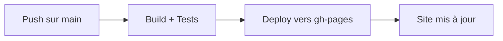

# 🚀 Workflow Unique CI/CD

## 📋 Vue d'ensemble

Ce projet utilise un **workflow unique** GitHub Actions qui combine :
- 🧪 **Tests automatiques** pour les Pull Requests
- 🚀 **Déploiement automatique** sur GitHub Pages

## 🔄 Fonctionnement du Workflow

### Déclencheurs
Le workflow se déclenche lors de :
- ✅ **Push** sur `main` ou `master` → Build + Déploiement
- ✅ **Pull Request** → Build + Tests seulement
- ✅ **Déclenchement manuel** via l'interface GitHub

### Processus Intelligent

#### Pour les Pull Requests


#### Pour les Push Direct


## 🌐 Accès au Site

Une fois déployé, votre documentation sera accessible sur :
```
https://pantheon-lab.github.io/
```

## 🛠️ Étapes du Workflow

### 1. Préparation
- **Checkout** du code source
- **Configuration** des credentials Git
- **Installation** de Python 3.11

### 2. Build
- **Cache** des dépendances (optimisation)
- **Installation** depuis `requirements.txt`
- **Build** MkDocs avec logs verbeux

### 3. Tests
- **Validation** du build
- **Statistiques** du site généré
- **Résumé** des résultats

### 4. Actions Conditionnelles

#### Si Pull Request
- 📦 **Upload artifacts** (site généré)
- 📋 **Résumé PR** avec infos détaillées
- ⏳ **Attente** du merge pour déploiement

#### Si Push sur main/master
- 🚀 **Déploiement** vers GitHub Pages
- 🌐 **Mise à jour** du site
- 📊 **Résumé** du déploiement

## 🔧 Configuration

### Prérequis
- [x] Repository public ou GitHub Pro/Team
- [x] Permissions `contents: write`
- [x] Fichier `mkdocs.yml` valide
- [x] Fichier `requirements.txt` avec dépendances

### Activation GitHub Pages
1. **Settings** → **Pages**
2. **Source** : `Deploy from a branch`
3. **Branch** : `gh-pages` (créée automatiquement)
4. **Folder** : `/ (root)`

## 📊 Monitoring

### Vérifier le statut
1. **Actions** → **Documentation CI/CD**
2. Voir les runs récents
3. Consulter les logs détaillés

### Télécharger les artifacts
Pour les PR, les artifacts sont disponibles :
1. Cliquez sur le run de la PR
2. Section **Artifacts**
3. Téléchargez `mkdocs-site-pr-XXX`

## 🐛 Dépannage

### Erreurs communes

#### 1. Build échoue
```bash
# Testez localement
mkdocs build --verbose
```

#### 2. Dépendances manquantes
Vérifiez `requirements.txt` :
```txt
mkdocs>=1.5.0
mkdocs-material>=9.0.0
mkdocs-git-revision-date-localized-plugin>=1.2.0
pymdown-extensions>=10.0.0
setuptools>=78.1.1
```

#### 3. Permissions GitHub Pages
Vérifiez dans Settings → Pages que :
- Source = `Deploy from a branch`
- Branch = `gh-pages`

### Logs détaillés
Le workflow utilise `--verbose` pour diagnostiquer les problèmes.

## 📈 Avantages du Workflow Unique

### Simplicité
- 🎯 **Un seul fichier** à maintenir
- 📝 **Configuration centralisée**
- 🔧 **Moins de complexité**

### Efficacité
- ⚡ **Build unique** pour test et déploiement
- 💾 **Cache partagé** entre PR et main
- 🔄 **Logique conditionnelle** intelligente

### Sécurité
- 🔒 **Pas de déploiement** depuis les PR
- ✅ **Tests obligatoires** avant merge
- 🛡️ **Permissions minimales**

## 🎯 Utilisation Pratique

### Développement avec PR
```bash
# 1. Créer une branche
git checkout -b feature/nouvelle-section

# 2. Modifier la documentation
vim docs/nouvelle-section.md

# 3. Commit et push
git add .
git commit -m "Add nouvelle section"
git push origin feature/nouvelle-section

# 4. Créer PR → Build automatique + Artifacts
```

### Déploiement direct
```bash
# Push direct sur main → Build + Deploy
git push origin main
```

## 📚 Ressources

- [Documentation GitHub Actions](https://docs.github.com/en/actions)
- [MkDocs gh-deploy](https://www.mkdocs.org/user-guide/deploying-your-docs/)
- [Workflow conditionnels](https://docs.github.com/en/actions/using-workflows/workflow-syntax-for-github-actions#jobsjob_idif)

---

✨ **Un seul workflow, deux fonctions : Test et Déploiement !** ✨ 