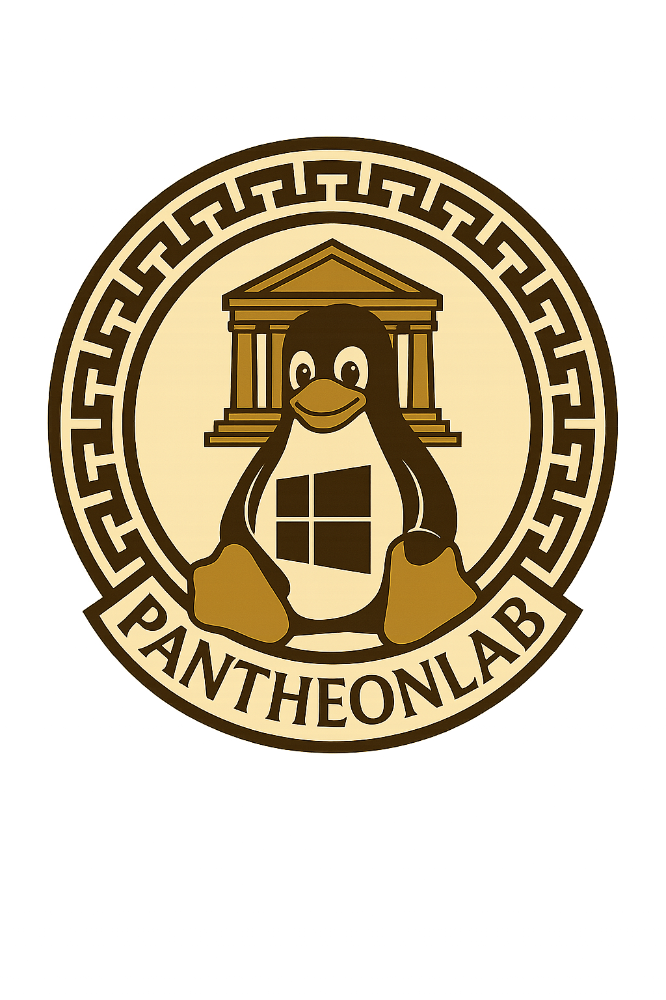

# 🌩️ PantheonLab - Le Panthéon de l'Active Directory Vulnérable

  

## 🏛️ Bienvenue dans l'Olympe de la Cybersécurité

PantheonLab est un lab immersif et modulaire dédié à l'apprentissage de la sécurité Active Directory et linux, le tout dans un univers inspiré du **Panthéon grec** !

### 🎯 Objectif du Projet

Ce lab propose un environnement prêts à l'emploi pour tester ces compétences en pentest linux et active directory :

- 🔍 **Passionnés de cybersécurité**
- 👨‍🏫 **Formateurs et enseignants**
- 🎓 **Étudiants en sécurité informatique**
- 💼 **Professionnels du domaine**

### 🌟 Caractéristiques Principales

!!! success "Fonctionnalités Clés"
    - **Environnement complet** : Windows Server + Linux + WordPress
    - **Thématique immersive** : Mythologie grecque 
    - **Scénarios progressifs** : Du débutant au niveau avancé
    - **Documentation complète** : Guides détaillés et writeups
    - **Automatisation** : Déploiement via Ansible et Vagrant

### 🏗️ Architecture du Lab

Le lab comprend trois machines virtuelles principales :

| Machine | Rôle |
|---------|------|
| **Olympe** | Serveur Linux |
| **DC01** | Contrôleur de domaine |
| **Enfers** | Serveur membre | 

### 📚 Navigation de la Documentation

Cette documentation est organisée en plusieurs sections :

- **[Présentation](presentation/overview.md)** : Vue d'ensemble du projet et de son architecture
- **[Installation](installation/prerequisites.md)** : Guide complet d'installation et de configuration
- **[Writeup](writeup/introduction.md)** : Solution détaillée du lab avec méthodologie
- **[Références](references/resources.md)** : ressources 

### 🤝 Contribution

Nous accueillons les contributions ! Que vous souhaitiez :

- Proposer de nouveaux scénarios
- Améliorer la documentation
- Corriger des bugs
- Ajouter de nouvelles fonctionnalités

N'hésitez pas à consulter notre guide de contribution et à ouvrir des issues ou pull requests.

---

*Que la sagesse d'Athéna, la ruse d'Hermès et la puissance de Zeus t'accompagnent dans ta quête  !* ⚡ 
