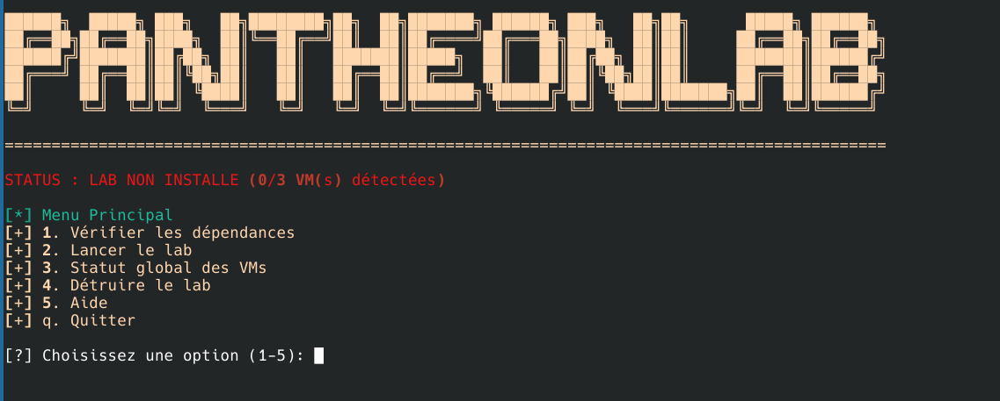

<!-- INSTALLATION -->

# Installation Rapide

## 🚀 Démarrage Express

Cette section vous guide à travers l'installation complète de PantheonLab en quelques étapes simples.

### Étape 1 : Clonage du Projet

```bash
# Cloner le dépôt principal
git clone https://github.com/0xbbuddha/pantheonlab
cd PantheonLab

```


### Étape 2 : Déploiement Automatique

!!! success "Méthode Recommandée"
    Utilisez le script de déploiement automatique pour une installation complète.

```bash
# Rendre le script exécutable
chmod +x pantheonlab.sh

# Lancer le déploiement complet
./pantheonlab.sh
```

Ce script permet de :

- Créer un environement virtuel
- Télécharger les dépendances python et ansible
- Lancer un terminal interactif Pantheon Lab


Une fois dans le terminal interactif: 


<div align="center">
  
</div>

| Option | Action                                                                                         |
|--------|------------------------------------------------------------------------------------------------|
| 1      | Permet de vérifier les dépendances nécessaires au lab ( a lancer avant chaque début de lab)     |
| 2      | Lance le lab                                                                                   |
| 3      | Donne des informations générales sur l'état des VMs dans le lab                                  |
| 4      | Détruit complètement le lab et toutes les ressources associées                                  |
| 5      | Aide                                                                                           |
| q      | Quitter                                                                                        |


## ⏱️ Temps d'Installation

!!! info "Temps estimé"
    ⏳ **Durée d'installation typique : ~40 minutes**

## 🔍 Monitoring de l'Installation  


### Suivi en Temps Réel

```bash
# Surveiller les VMs
vagrant status


# Surveiller les processus
watch -n 5 'ps aux | grep -E "(vagrant|vbox|ansible)"'
```


