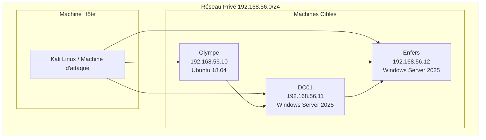
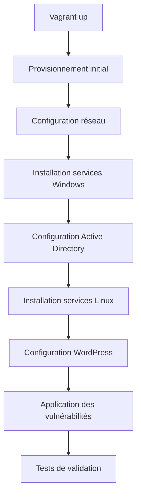

# Architecture Technique

## 🏗️ Vue d'ensemble de l'Architecture

PantheonLab est conçu avec une architecture modulaire et scalable, permettant une déploiement facile et une personnalisation poussée. L'ensemble repose sur des technologies modernes d'orchestration et d'automatisation.

## 🌐 Topologie Réseau

### Schéma Réseau



### Configuration Réseau

| Élément | Configuration | Description |
|---------|---------------|-------------|
| **Réseau** | 192.168.56.0/24 | Réseau privé VirtualBox |
| **Gateway** | 192.168.56.1 | Interface NAT VirtualBox |
| **DNS** | 192.168.56.11 | DC01 (contrôleur de domaine) |
| **Domaine** | pantheon.god | Nom de domaine Active Directory |

## 🖥️ Machines Virtuelles

### 1. Olympe (Serveur Linux/WordPress)

```yaml
Spécifications:
  OS: Ubuntu 18.04 LTS (Bionic Beaver)
  IP: 192.168.56.10
  Hostname: OlympeWordpress
  Mémoire: 2GB RAM
  CPU: 2 cores
  Disque: 20GB

Services:
  - Apache 2.4.29
  - MySQL 5.7
  - PHP 7.2
  - WordPress 6.8.1
  - SSH (port 22)
  - HTTP (port 80)

Rôle: Point d'entrée principal, serveur web vulnérable
```

### 2. DC01 (Contrôleur de Domaine)

```yaml
Spécifications:
  OS: Windows Server 2025 Standard
  IP: 192.168.56.11
  Hostname: pantheon-dc01
  Mémoire: 4GB RAM
  CPU: 2 cores
  Disque: 40GB

Services:
  - Active Directory Domain Services
  - DNS Server
  - DHCP Server
  - Certificate Services (ADCS)
  - File Services
  - RDP (port 3389)
  - WinRM (port 5985)

Rôle: Contrôleur de domaine principal, centre d'authentification
```

### 3. Enfers (Serveur Membre)

```yaml
Spécifications:
  OS: Windows Server 2025 Standard
  IP: 192.168.56.12
  Hostname: pantheon-enfers
  Mémoire: 4GB RAM
  CPU: 2 cores
  Disque: 40GB

Services:
  - File Services
  - Print Services
  - Web Services (IIS)
  - RDP (port 3389)
  - WinRM (port 5985)
  - SMB (port 445)

Rôle: Serveur membre du domaine, services partagés
```

## 🔧 Infrastructure d'Orchestration

### Vagrant Configuration

Le fichier `Vagrantfile` principal orchestre le déploiement :

```ruby
# Configuration des VMs
config.vm.define "olympe-wordpress" do |olympe|
  olympe.vm.box = "hashicorp/bionic64"
  olympe.vm.network "private_network", ip: "192.168.56.10"
  # Configuration spécifique...
end

config.vm.define "pantheon-dc01" do |dc01|
  dc01.vm.box = "gusztavvargadr/windows-server-2025-standard"
  dc01.vm.network "private_network", ip: "192.168.56.11"
  # Configuration spécifique...
end
```

### Ansible Structure

L'automatisation Ansible est organisée de manière modulaire :

```
ansible/
├── inventory/           # Inventaires des machines
├── group_vars/         # Variables par groupe
├── vars/              # Variables globales
├── files/             # Fichiers à déployer
├── templates/         # Templates Jinja2
└── playbooks/         # Playbooks d'exécution
    ├── windows_*.yml  # Configuration Windows
    ├── linux_*.yml    # Configuration Linux
    └── scripts/       # Scripts utilitaires
```

## 🎯 Configuration Active Directory

### Structure du Domaine

```yaml
Domaine: pantheon.god
NetBIOS: PANTHEON
Mode fonctionnel: Windows Server 2025

Unités d'Organisation:
  - Gods (Utilisateurs dieux)
  - Servants (Comptes de service)
  - Resources (Ressources partagées)
  - Security (Politiques de sécurité)

Groupes:
  - Olympians (Administrateurs)
  - Minor Gods (Utilisateurs standard)
  - Demigods (Utilisateurs privilégiés)
```

### Utilisateurs et Rôles

| Utilisateur | Rôle | Groupe | Description |
|-------------|------|--------|-------------|
| **zeus** | Administrateur | Olympians | Roi des dieux, admin domaine |
| **hera** | Utilisateur | Minor Gods | Reine, politique stricte |
| **hermes** | Utilisateur | Minor Gods | Messager, communication |
| **athena** | Utilisateur | Minor Gods | Sagesse, monitoring |
| **ares** | Utilisateur | Minor Gods | Guerre, attaques |
| **aphrodite** | Utilisateur | Minor Gods | Beauté, social engineering |

## 🔒 Vulnérabilités Intégrées

### Niveau 1 : WordPress (Olympe)

```yaml
Vulnérabilités:
  - Plugin CMP Coming Soon (4.1.13) - Authentification bypass
  - Directory listing activé
  - XML-RPC activé
  - Upload directory accessible
  - Credentials faibles (hermes:y)

Vecteurs d'attaque:
  - Authentification bypass
  - File upload
  - Information disclosure
  - Privilege escalation
```

### Niveau 2 : Active Directory (DC01/Enfers)

```yaml
Vulnérabilités:
  - Politiques de mot de passe faibles
  - Kerberoasting possible
  - AS-REP Roasting
  - ACL mal configurées
  - GPO vulnérables
  - Services avec SPN

Vecteurs d'attaque:
  - Password spraying
  - Kerberos attacks
  - ACL abuse
  - GPO abuse
  - Lateral movement
```

## 📊 Monitoring et Logs

### Configuration Logs

```yaml
Windows Event Logs:
  - Security: Audit complet
  - System: Événements système
  - Application: Applications
  - Directory Service: AD events

Linux Logs:
  - /var/log/apache2/: Logs web
  - /var/log/mysql/: Logs base de données
  - /var/log/auth.log: Authentification
  - /var/log/syslog: Système général
```

### Outils de Monitoring

- **Windows**: Event Viewer, PowerShell logging
- **Linux**: rsyslog, fail2ban
- **Réseau**: Wireshark, tcpdump
- **Application**: WordPress debug logs

## 🔄 Workflow de Déploiement

### Étapes Automatisées



### Scripts de Déploiement

```bash
# Déploiement complet
./dc.sh

# Déploiement manuel
vagrant up
ansible-playbook -i ansible/inventory/administrator_inventory.yml ansible/playbooks/windows_main.yml
```

## 🛠️ Personnalisation

### Variables Configurables

```yaml
# ansible/vars/default.yml
network:
  domain: pantheon.god
  subnet: 192.168.56.0/24
  gateway: 192.168.56.1

users:
  admin_password: "Zeus@2025!"
  user_password: "y"
  
wordpress:
  db_name: "pantheon_wp"
  db_user: "wp_user"
  db_password: "wp_pass"
```

### Extensibilité

Le projet est conçu pour être facilement extensible :

- **Nouvelles machines** : Ajout dans Vagrantfile
- **Nouveaux scénarios** : Playbooks Ansible
- **Nouvelles vulnérabilités** : Templates configurables
- **Nouveaux outils** : Scripts d'installation

---

*L'architecture de PantheonLab combine robustesse technique et flexibilité pédagogique pour offrir un environnement d'apprentissage optimal.* 🏛️ 