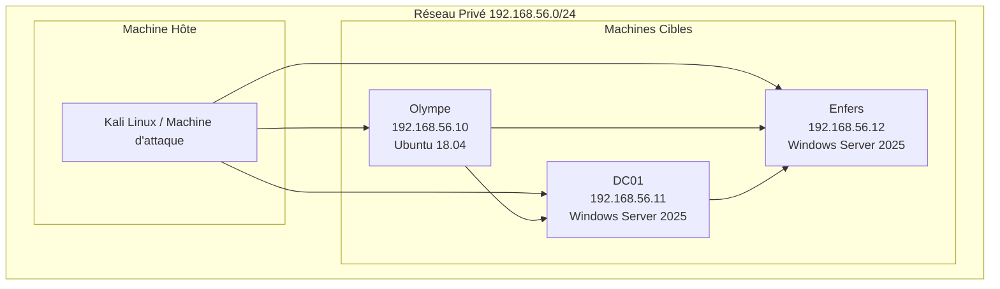

# Architecture Technique

## 🏗️ Vue d'ensemble de l'Architecture

PantheonLab est conçu avec une architecture modulaire et scalable, permettant une déploiement facile et une personnalisation poussée. L'ensemble repose sur des technologies modernes d'orchestration et d'automatisation.

## 🌐 Topologie Réseau

### Schéma Réseau

