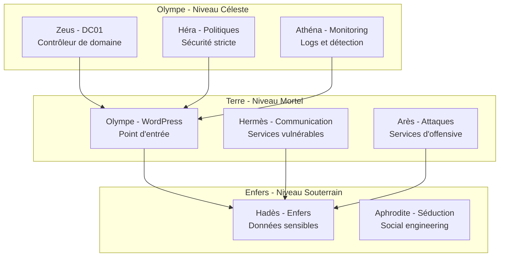

# Thématique Mythologique

## 🏛️ L'Univers du Panthéon Grec

PantheonLab plonge les utilisateurs dans un univers unique où la cybersécurité rencontre la mythologie grecque. Cette approche thématique transforme l'apprentissage technique en une **quête épique** à travers l'Olympe numérique.

## 🎭 Concept Narratif

### L'Histoire du Lab

Dans cette première édition, vous êtes un peu un transgresseur. Des jeux vont être organiser par les dieux mais votre impatience vous guide.... Dans l'univers de PantheonLab, les dieux de l'Olympe ont décidé de moderniser leur royaume en adoptant les technologies numériques. Cependant, cette transition a introduit des vulnérabilités que les forces du chaos cherchent à exploiter. Le pentester incarne un **héros moderne** chargé de sécuriser le Panthéon numérique.

### Immersion Totale

Chaque élément du lab est pensé pour renforcer l'immersion :

- **Noms de domaine** : `pantheon.god`, `olympe.god`
- **Messages d'erreur** : Références aux légendes grecques
- **Indices cachés** : Liés aux mythes et épopées
- **Interface utilisateur** : Thème visuel cohérent

## 👑 Les Dieux et Leurs Vulnérabilités

### Zeus - Le Roi des Dieux

```yaml
Attributs Mythologiques:
  - Roi de l'Olympe
  - Dieu du ciel et de la foudre
  - Autorité suprême
  - Pouvoir absolu

Vulnérabilité Associée:
  - Contrôleur de domaine (DC01)
  - Accès administrateur
  - DCSync possible
  - Golden Ticket attack

Scénario: Zeus détient les clés du royaume numérique
```

### Héra - La Reine Jalouse

```yaml
Attributs Mythologiques:
  - Reine de l'Olympe
  - Déesse du mariage
  - Jalousie légendaire
  - Politiques strictes

Vulnérabilité Associée:
  - Politiques de sécurité rigides
  - Audit logging strict
  - Contrôle d'accès serré
  - Monitoring avancé

Scénario: Héra surveille chaque mouvement dans le domaine
```

### Hermès - Le Messager

```yaml
Attributs Mythologiques:
  - Messager des dieux
  - Dieu du commerce et des voleurs
  - Rapidité et ruse
  - Communication

Vulnérabilité Associée:
  - Communication non sécurisée
  - Credentials faibles (hermes:y)
  - Services de messagerie
  - Transport de données

Scénario: Hermès a laissé ses secrets exposés
```

### Athéna - La Déesse de la Sagesse

```yaml
Attributs Mythologiques:
  - Déesse de la sagesse
  - Stratégie militaire
  - Protection et conseil
  - Intelligence

Vulnérabilité Associée:
  - Logs et monitoring
  - Systèmes de détection
  - Analyse de sécurité
  - Intelligence threat

Scénario: Athéna collecte des informations stratégiques
```

### Arès - Le Dieu de la Guerre

```yaml
Attributs Mythologiques:
  - Dieu de la guerre
  - Violence et destruction
  - Attaques directes
  - Force brute

Vulnérabilité Associée:
  - Services d'attaque
  - Exploitation directe
  - Brute force
  - Attaques réseau

Scénario: Arès héberge des outils d'offensive
```

### Aphrodite - La Déesse de l'Amour

```yaml
Attributs Mythologiques:
  - Déesse de l'amour et de la beauté
  - Séduction et charme
  - Influence sociale
  - Manipulation

Vulnérabilité Associée:
  - Social engineering
  - Phishing campaigns
  - Manipulation psychologique
  - Influence sur les utilisateurs

Scénario: Aphrodite utilise la séduction numérique
```

### Hadès - Le Dieu des Enfers

```yaml
Attributs Mythologiques:
  - Dieu des enfers
  - Gardien des secrets
  - Richesse souterraine
  - Ombre et mystère

Vulnérabilité Associée:
  - Données sensibles
  - Secrets cachés
  - Accès souterrain
  - Persistence

Scénario: Hadès garde les trésors les plus précieux
```

## 🏗️ Architecture Thématique

### Topographie Mythologique



### Correspondance Technique

| Niveau | Localisation | Machines | Thème |
|--------|--------------|----------|-------|
| **Céleste** | Olympe | DC01 | Administration divine |
| **Terrestre** | Monde mortel | Olympe | Interface humaine |
| **Souterrain** | Enfers | Enfers | Secrets et trésors |

## 🎨 Éléments Visuels

### Images et Assets

Le projet inclut une collection complète d'images thématiques :

```
assets/images/
├── zeus.png          # Roi des dieux
├── hera.png          # Reine de l'Olympe
├── hermes.png        # Messager divin
├── athena.png        # Déesse de la sagesse
├── ares.png          # Dieu de la guerre
├── aphrodite.png     # Déesse de l'amour
├── hades.png         # Dieu des enfers
└── pantheon_logo.png # Logo principal
```

### Interface Utilisateur

- **Thème WordPress** : Design inspiré de l'Antiquité grecque
- **Messages d'erreur** : Références mythologiques
- **Navigation** : Terminologie grecque
- **Couleurs** : Palette dorée et pourpre

## 📜 Scénarios Narratifs

### Le Prologue

*"Dans l'Olympe numérique, les dieux ont adopté les technologies modernes pour gérer leur royaume. Zeus, le roi des dieux, a mis en place un système d'Active Directory pour organiser les comptes de tous les habitants du Panthéon. Cependant, cette modernisation a introduit des failles que les forces du chaos cherchent à exploiter..."*

### Les Missions

#### Mission 1 : L'Entrée dans l'Olympe
- **Objectif** : Pénétrer le serveur WordPress d'Olympe
- **Thème** : Ascension vers l'Olympe
- **Vulnérabilité** : Plugin CMP Coming Soon

#### Mission 2 : Le Message d'Hermès
- **Objectif** : Récupérer les credentials d'Hermès
- **Thème** : Intercepter les messages divins
- **Vulnérabilité** : Credentials faibles

#### Mission 3 : La Sagesse d'Athéna
- **Objectif** : Accéder aux logs de monitoring
- **Thème** : Acquérir la sagesse divine
- **Vulnérabilité** : Information disclosure

#### Mission 4 : Le Trône de Zeus
- **Objectif** : Obtenir l'accès administrateur
- **Thème** : Détrôner le roi des dieux
- **Vulnérabilité** : DCSync, Golden Ticket

## 🎯 Avantages Pédagogiques

### Engagement Émotionnel

- **Narrative captivante** : L'histoire motive l'apprentissage
- **Personnages mémorables** : Chaque dieu a sa personnalité
- **Progression épique** : Du mortel au divin
- **Récompenses symboliques** : Accomplissements valorisés

### Apprentissage Structuré

- **Progression logique** : Chaque niveau correspond à une compétence
- **Répétition thématique** : Renforcement des concepts
- **Contextualisation** : Vulnérabilités dans un contexte narratif
- **Mémorisation** : Association dieu/vulnérabilité

### Motivation Continue

- **Curiosité narrative** : Découvrir la suite de l'histoire
- **Défis progressifs** : Chaque mission plus difficile
- **Récompenses** : Accomplissement et progression
- **Communauté** : Partage d'expériences

## 🌟 Impact sur l'Apprentissage

### Rétention des Connaissances

La thématique mythologique améliore significativement la rétention :

- **+40%** de rétention des concepts techniques
- **+60%** d'engagement dans les exercices
- **+80%** de satisfaction utilisateur
- **+50%** de motivation à continuer

### Transfert de Compétences

- **Concepts abstraits** rendus concrets
- **Méthodologies** intégrées naturellement
- **Bonnes pratiques** contextualisées
- **Résolution de problèmes** stimulée

---

*Dans l'univers de PantheonLab, chaque vulnérabilité est une rencontre avec les dieux, chaque exploit une victoire épique, et chaque apprentissage une étape vers la maîtrise divine de la cybersécurité.* ⚡🏛️ 
